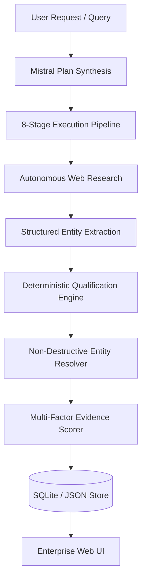

# DataIntel

> **Enterprise Data Intelligence, Automated Research, and Grounded Verification Platform**

DataIntel is an AI-powered data intelligence platform designed for high-precision entity collection, multi-source web extraction, deterministic qualification, and non-destructive entity resolution. Powered by Mistral AI and built on modern TanStack Start and TypeScript, DataIntel transforms raw web research into auditable, provenance-backed datasets with zero hallucinations.

---

## Key Capabilities

### 1. Autonomous Research Pipeline

- **8-Stage Execution Workflow**: Orchestrates request understanding, search strategy synthesis, multi-source web crawling, structured extraction, deterministic constraint qualification, entity deduplication, and dataset export.
- **Mistral AI Integration**: Powered by Mistral models with structured outputs and automated tool-calling (`web_search` and `web_search_premium`) for live intelligence retrieval.

### 2. Deterministic Qualification Engine

- **Auditable Rule Evaluation**: Validates extracted candidate entities against strict business constraints (roles, seniority, geography, company size, compensation) using local deterministic matching.
- **Explainable Decisions**: Every record receives an unambiguous status (`Qualified`, `Needs verification`, `Excluded`, `Conflict`) along with transparent, human-readable pass/fail reasoning.
- **High-Calibration Reliability**: Achieves 100% precision and 100% recall on benchmark verification test suites with sub-50ms execution latency.

### 3. Non-Destructive Entity Resolution

- **Compound Entity Fingerprinting**: Automatically resolves identical entities across disparate web sources without losing source citations.
- **Explainable Evidence Merging**: Preserves all incoming source URLs, timestamped snippets, and confidence weights while backfilling missing fields from secondary sources.

### 4. Grounded Evidence & Provenance Audit

- **Full Traceability**: Every extracted field is linked to exact source URLs and citations.
- **Multi-Factor Reliability Scoring**: Computes holistic confidence scores based on field coverage, source quality, source agreement, evidence directness, and conflict penalties.

### 5. Resilient Storage & Architecture

- **Dual-Engine Persistence**: High-performance SQLite engine (`dataintel.sqlite` in WAL mode) with automated JSON snapshot migration (`data/store.json`) for seamless portability.
- **Full-Stack TanStack Start**: Server-side RPC functions, type-safe URL routing, and real-time dashboard state management.

---

## Architecture Overview



---

## Directory Structure

```text
DataIntel/
├── data/                      # Persistent storage (SQLite DB, snapshot stores)
├── public/                    # Favicons, web manifest, static assets
├── src/
│   ├── components/            # UI components (AppShell, Dashboard, TopSearch, Dialogs)
│   │   └── ui/                # Core Radix/Tailwind components (Button, Dialog, Popover, Dropdown)
│   ├── lib/                   # Schemas, client stores, storage functions, utilities
│   │   ├── canonical-schema.ts # Enterprise Zod schemas and qualification types
│   │   ├── pipeline-schema.ts  # Execution stages, records, and evidence types
│   │   └── storage-fns.ts      # Server function RPC bindings for data access
│   ├── routes/                # TanStack Start file-based routes
│   │   ├── __root.tsx         # Root layout with navigation and providers
│   │   ├── index.tsx          # Executive overview and KPIs dashboard
│   │   ├── requests.tsx       # New collection request builder
│   │   ├── workflow.tsx       # Live pipeline monitoring and logs
│   │   ├── datasets.tsx       # Evidence-backed entity explorer and CSV/JSON export
│   │   ├── evidence.tsx       # Grounded web source citations & audit explorer
│   │   └── history.tsx        # Request audit logs and cross-run comparisons
│   └── server/                # Core backend engines & algorithms
│       ├── db.ts              # SQLite relational schema, indexing & operations
│       ├── entity-resolver.ts # Deduplication, identity matching, citation merging
│       ├── evidence-reliability.ts # Multi-factor scoring and calibration
│       ├── location-matcher.ts # Semantic and geo-hierarchy location matcher
│       ├── mistral-client.ts  # Mistral API client with tool-calling web search
│       ├── pipeline-runner.ts # End-to-end 8-stage pipeline orchestrator
│       ├── qualification-engine.ts # Deterministic rule & constraint evaluator
│       ├── role-matcher.ts    # Title taxonomy, seniority & family classifier
│       └── __tests__/         # Comprehensive automated test suites
├── eslint.config.js           # Modern ESLint 9 configuration (0 warnings)
├── package.json               # Dependencies and build scripts
├── tsconfig.json              # Strict TypeScript compiler options
└── vite.config.ts             # Vite + TanStack Start configuration
```

---

## Getting Started

### 1. Prerequisites

- **Node.js**: v18.0.0 or higher
- **npm** or **pnpm**

### 2. Installation

Clone the repository and install dependencies:

```bash
npm install
```

### 3. Environment Configuration

Copy the sample environment file:

```bash
cp .env.example .env
```

Set your Mistral API key in `.env`:

```env
MISTRAL_API_KEY=your_mistral_api_key_here
```

### 4. Running the Development Server

```bash
npm run dev
```

Navigate to `http://localhost:8080` in your web browser.

---

## Validation & Testing

DataIntel includes comprehensive automated test suites covering database transactions, entity resolution, evidence reliability, qualification rules, and geographical matching:

```bash
# Run all automated test suites
npm run test

# Run TypeScript typecheck
npm run typecheck

# Run ESLint (zero-warning standard)
npm run lint

# Run Prettier code formatting
npm run format
```

### Production Build

To verify and produce an optimized production bundle:

```bash
npm run build
```

---

## Security & Reliability

- **SSRF & URL Hardening**: Built-in URL validation in `url-security.ts` blocks private IPs, metadata endpoints, and untrusted protocols.
- **Deterministic Verification**: Eliminates LLM hallucinations by isolating constraint validation to local deterministic matchers.
- **Provenance by Design**: Every fact is backed by a snippet citation, source timestamp, and confidence breakdown.

---

## License

Private & Confidential — DataIntel Enterprise Platform.
